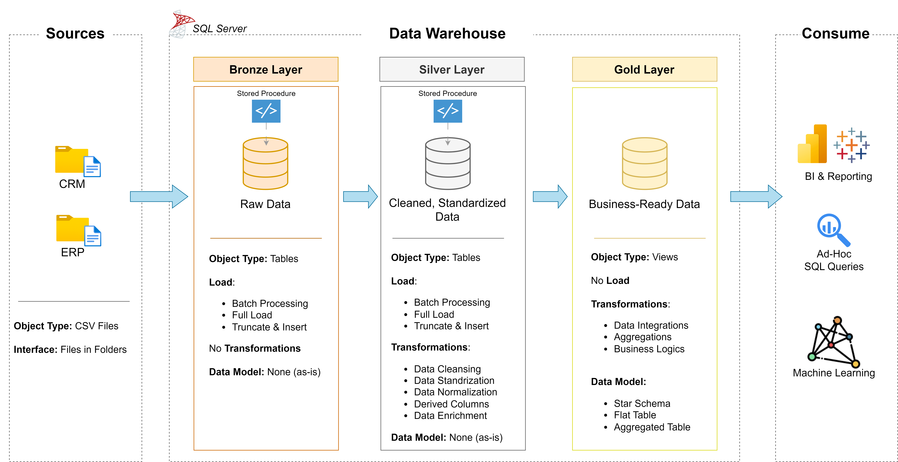
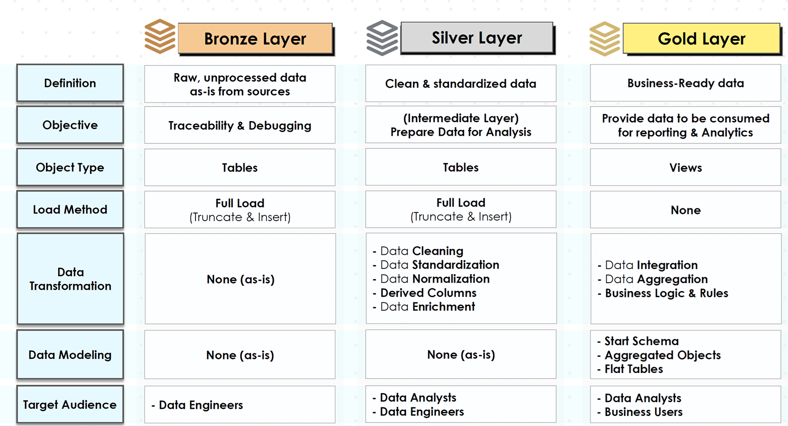

# Data Warehouse Project | End-to-End ETL Solution
Welcome to the **Data Warehouse Project** repository!
This project demonstrates the design and implementation of a scalable SQL-based Data Warehouse solution, built using real-world ETL and data modeling principles.

It reflects practical Data Engineering capabilities including data ingestion, transformation and modeling. Designed as a portfolio project highlights industry best practices in data engineering.

---
## Business Problem
Organizations often struggle with:

- Fragmented data across systems
- Slow and inconsistent reporting
- Lack of a centralized analytics layer

## Objective: 
Build a centralized Data Warehouse to:

- Consolidate raw data
- Keep latest data and remove historical unwanted data
- Enable fast analytical queries
- Support business decision-making

---
### Specifications
-	**Data Sources**: Import data from two source systems (ERP and CRM) provided as CSV files.
-	**Data Quality**: Cleanse and resolve data quality issues prior to analysis.
-	**Integration**: Combine both sources into a single, user-friendly data model designed for analytical queries.
-	**Scope**: Fous on te latest dataset only; historization of data is not required.
-	**Documentation**: Provide clear documentation of the data model to support both business stakeholders and analytics teams.

---
## Solution Architecture
### Layered Data Architecture (Medallion Architecture) ###

### ETL Overview
**1. Data Ingestion (Bronze Layer)**
- Raw data loaded into staging tables
- No transformations applied
  
**2. Data Transformation (Silver Layer)**
- Data cleansing (null handling, duplicates removal)
- Business rule implementation
- Data enrichment

**3. Data Warehouse Loading (Gold Layer)**
- Fact & dimension tables populated
- Referential integrity maintained

### ETL Task Roadmap ###

### Key Design Principles: ###
- Separation of concerns (raw vs processed data)
- Scalable ETL design
- Optimized query performance

---

---
)
---
## License
This project is licensed under the [MIT License](LICENSE). You are free to use, modify, and share this project with proper attribution.
## About Me
Hi there! I’m **Ram Kumar**. I’m an IT professional, working as a Data Engineer. I have 14+ years of experience in Data Analytics, Data Engineering. 
